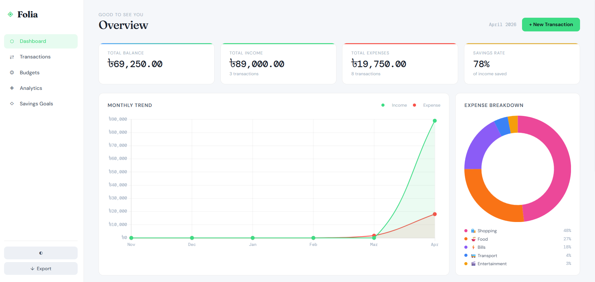
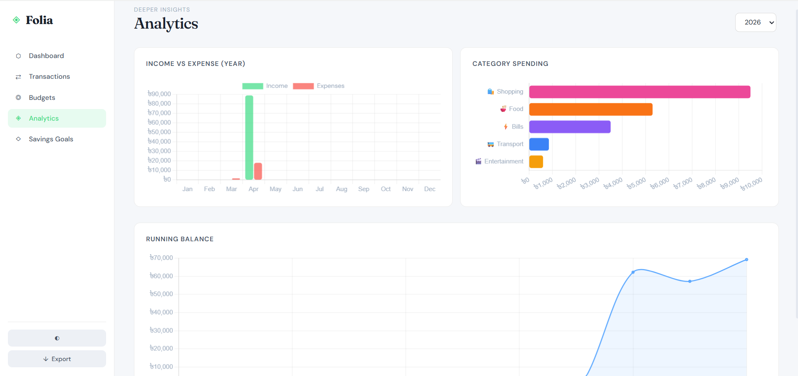
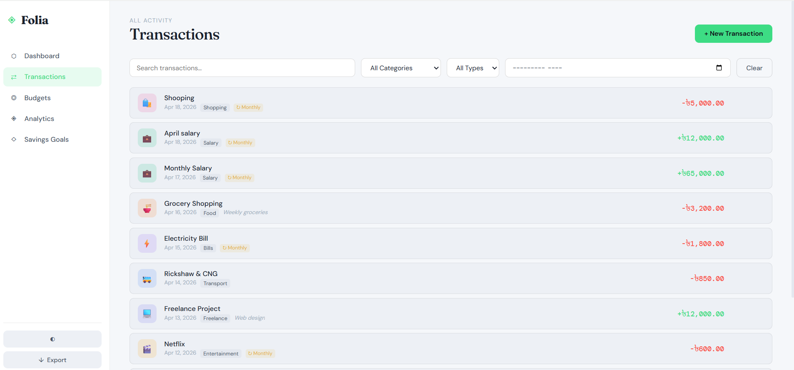
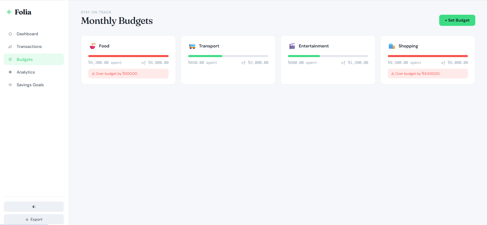
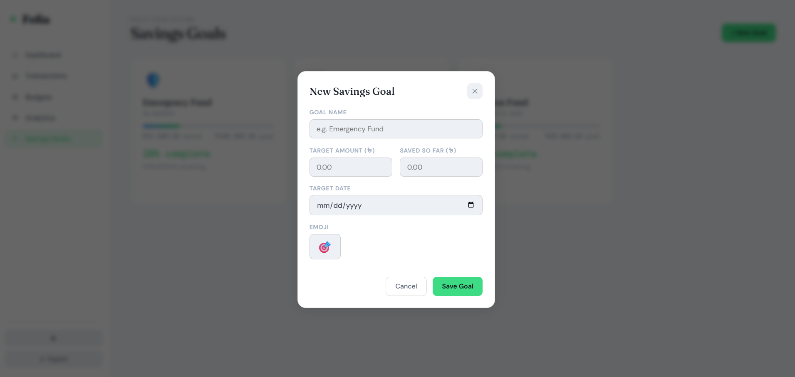
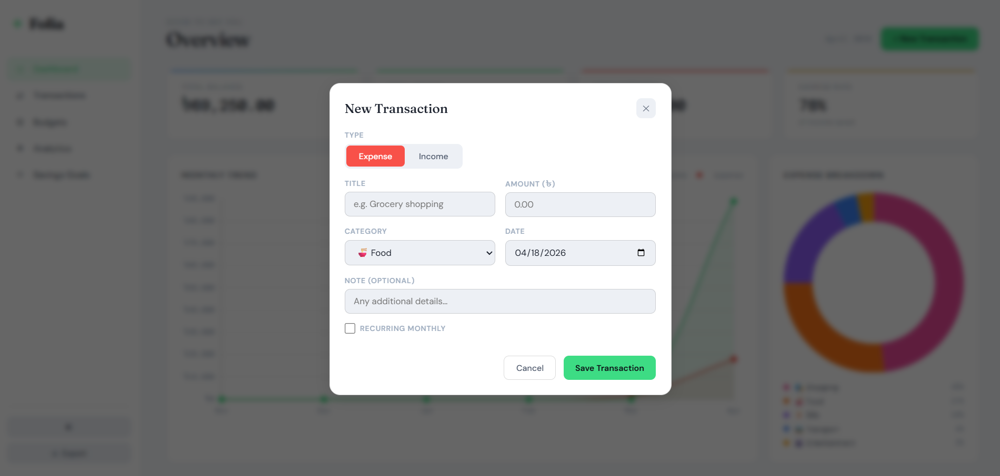

# Folia — Personal Budget Tracker

A modern, elegant personal finance management application built with vanilla JavaScript, HTML5 and CSS3. Track your income, expenses, set budgets and visualize your financial data with beautiful charts.








## ✨ Features

### 💰 Core Functionality
- **Transaction Tracking**: Add, edit and categorize income and expense transactions
- **Budget Management**: Set monthly spending limits for different categories
- **Savings Goals**: Create and track progress towards financial goals
- **Data Persistence**: All data is stored locally in your browser

### 📊 Analytics & Visualization
- **Dashboard Overview**: Summary cards showing total balance, income, expenses and savings rate
- **Monthly Trend Charts**: Line chart showing income vs expenses over time
- **Expense Breakdown**: Donut chart visualizing spending by category
- **Yearly Analytics**: Bar charts for income vs expense comparison and category spending
- **Running Balance**: Line chart showing balance progression over time

### 🎨 User Experience
- **Dark/Light Theme**: Toggle between themes with smooth transitions
- **Responsive Design**: Works perfectly on desktop and mobile devices
- **Intuitive Navigation**: Clean sidebar navigation with page-specific content
- **Real-time Updates**: Charts and summaries update instantly as you add transactions

### 🛠️ Additional Features
- **Advanced Filtering**: Filter transactions by category, type, and date
- **Search Functionality**: Quickly find specific transactions
- **Export Data**: Export your financial data as CSV
- **Category Icons**: Visual category representation with custom icons and colors

## 🚀 Getting Started

### Prerequisites
- A modern web browser (Chrome, Firefox, Safari, Edge)
- No additional software required - runs entirely in the browser

### Installation

1. **Clone the repository**
   ```bash
   git clone https://github.com/yourusername/folia-budget-tracker.git
   cd folia-budget-tracker
   ```

2. **Open in browser**
   - Open `index.html` in your web browser
   - Or serve via a local web server for better experience:
     ```bash
     # Using Python
     python -m http.server 8000

     # Using Node.js
     npx serve .

     # Using PHP
     php -S localhost:8000
     ```

3. **Start tracking!**
   - Add your first transaction
   - Set up budgets for different categories
   - Create savings goals
   - Explore the analytics

## 📱 Usage

### Adding Transactions
1. Click the "+ New Transaction" button on the Dashboard or Transactions page
2. Fill in the transaction details:
   - Title and amount
   - Category (Food, Transport, Bills, etc.)
   - Date and optional notes
   - Mark as recurring if applicable

### Setting Budgets
1. Navigate to the "Budgets" page
2. Click "+ Set Budget"
3. Choose a category and set your monthly spending limit
4. Monitor your progress on the dashboard

### Creating Savings Goals
1. Go to the "Savings Goals" page
2. Click "+ New Goal"
3. Set a target amount, deadline, and choose an emoji
4. Track your progress as you save

### Viewing Analytics
- **Dashboard**: Quick overview with summary cards and recent charts
- **Analytics Page**: Detailed yearly insights with multiple chart types
- All charts are interactive and update in real-time

## 🏗️ Project Structure

```
folia-budget-tracker/
├── index.html          # Main HTML file
├── styles.css          # CSS styles and themes
├── app.js             # Main application logic
└── README.md          # This file
```

## 🛠️ Technologies Used

- **Frontend**: HTML5, CSS3, JavaScript (ES6+)
- **Charts**: Chart.js 4.4.0 for data visualization
- **Fonts**: Google Fonts (Fraunces, DM Sans, DM Mono)
- **Storage**: Browser Local Storage for data persistence
- **Icons**: Unicode emojis for category representation

## 🎨 Customization

### Adding New Categories
Edit the `CATEGORIES` array in `app.js`:

```javascript
const CATEGORIES = [
  { name: 'Your Category', icon: '🎯', color: '#your-color' },
  // ... existing categories
];
```

### Styling
- Colors and themes are defined in CSS custom properties (variables)
- Modify `--bg`, `--text`, `--accent` etc. in `:root` for theme changes
- Responsive breakpoints are defined for mobile optimization

## 🤝 Contributing

Contributions are welcome! Please feel free to submit a Pull Request.

1. Fork the project
2. Create your feature branch (`git checkout -b feature/AmazingFeature`)
3. Commit your changes (`git commit -m 'Add some AmazingFeature'`)
4. Push to the branch (`git push origin feature/AmazingFeature`)
5. Open a Pull Request

### Development Guidelines
- Follow the existing code style and JSDoc comments
- Test on multiple browsers
- Ensure responsive design works on mobile
- Add new features to the appropriate sections

## 📄 License

This project is open source and available under the [MIT License](LICENSE).

## 🙏 Acknowledgments

- Chart.js for the amazing charting library
- Google Fonts for the beautiful typography
- The open source community for inspiration and tools

## 📞 Support

If you find this project helpful, please give it a ⭐ on GitHub!

For questions or issues, please open an issue on the GitHub repository.

---

**Made with ❤️ for personal finance management**
